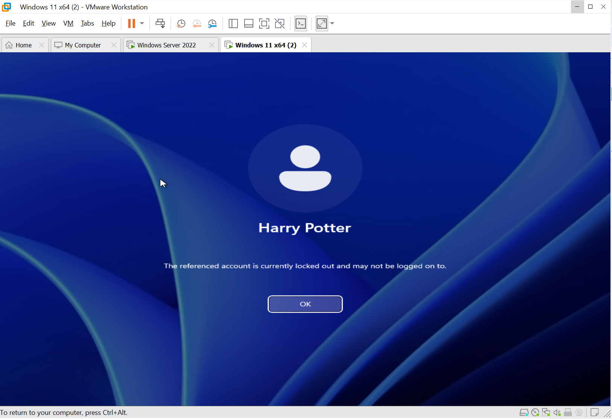
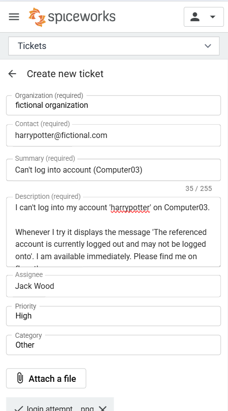
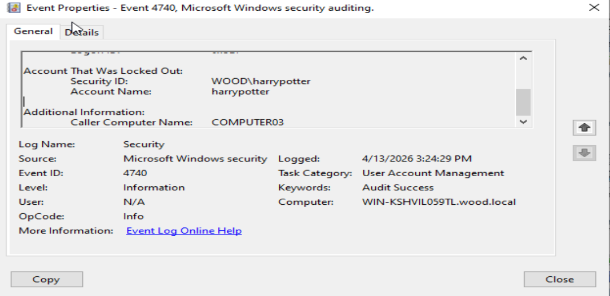
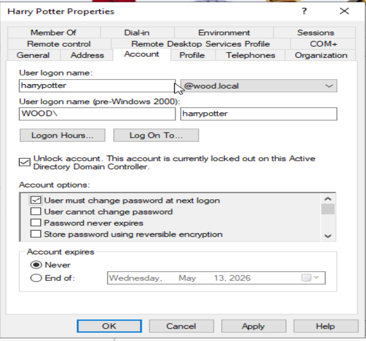
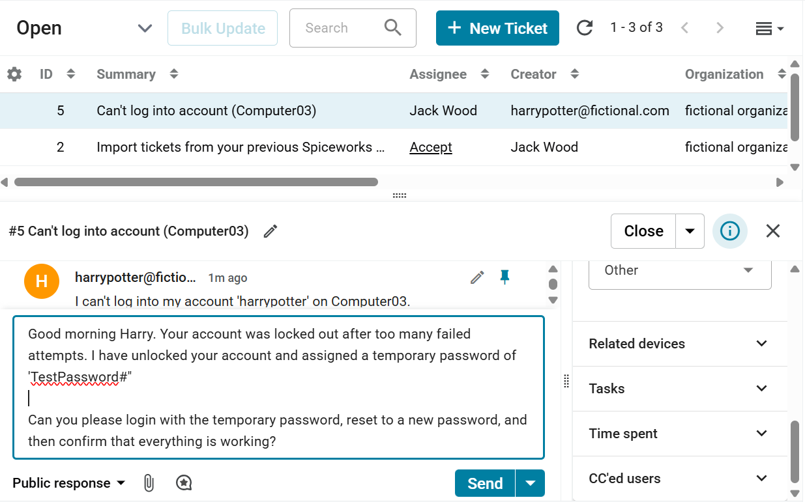

# Ticketing-System-Lab
This repository documents a ticketing system lab that I created. Using Spiceworks, I create tickets for issues that have appeared within my Active Directory homelab. These are then resolved and closed after confirming with the user. 

## Ticket One - User can't log into computer

#### 1. Account lockout on client machine of COMPUTER03 for user Harry Potter.

#### 2. User 'Harry Potter' creates a ticket detailing the issue 
 - Describes device affected, details of the screen, where he can be found
 - Priority is HIgh because he cannot complete any tasks
 - Category 'Other' because 'account issues' not listed

    

#### 3. Confirmed on Windows Server in Event Viewer that there is an account lockout on COMPUTER03 by ‘harrypotter’.
- Event viewer > windows logs > security
- Selected ‘Filter Current Log’ for code 4740

#### 4. Unlocked account in 'Active Directory Users and Computers' and provided temporary password of ‘TestPassword#’

#### 5. Closed ticket after confirming with Harry Potter that everything is working well.
 - Later conducted a post-resolution follow-up.

       
      

