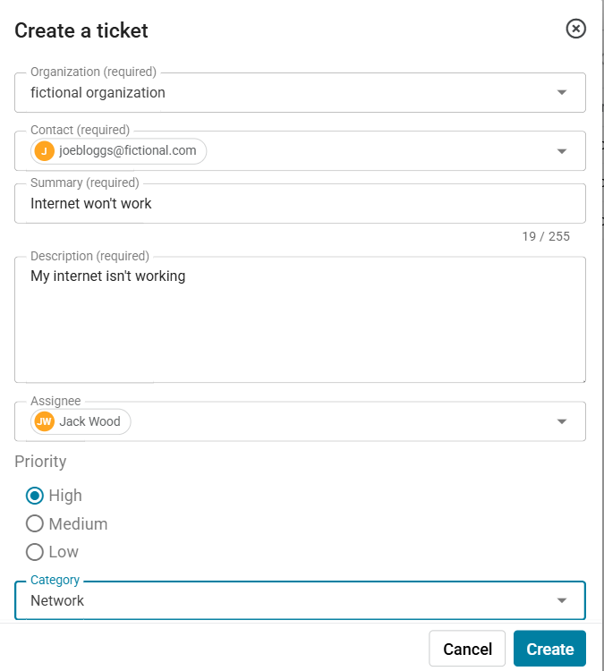
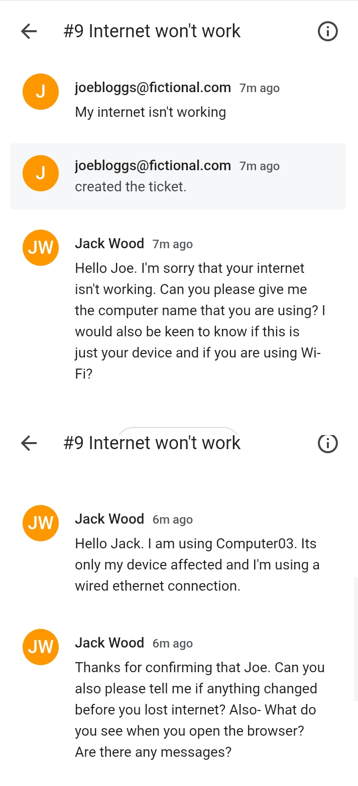
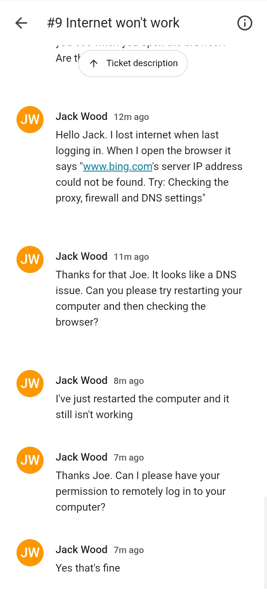
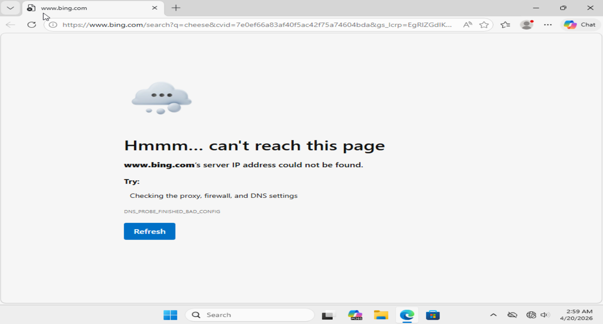
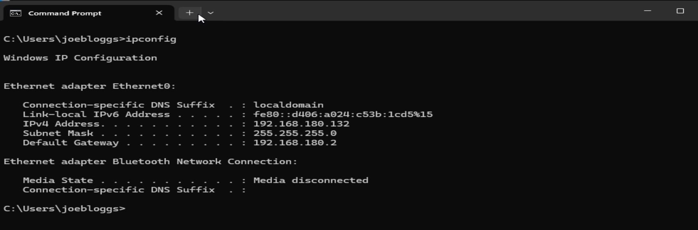
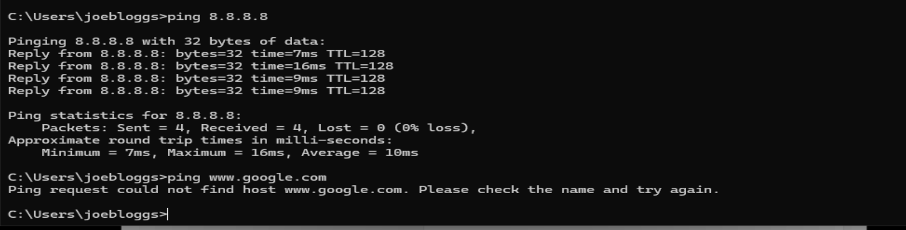
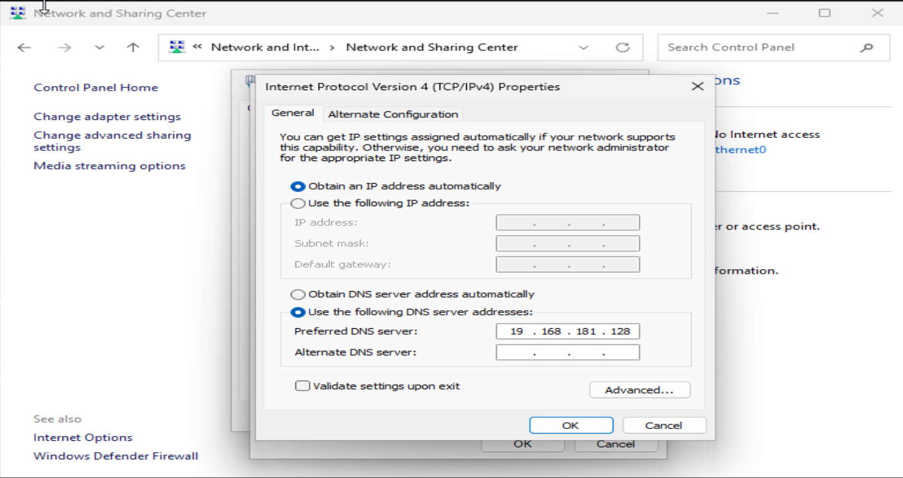

# Ticketing-System-Lab
This repository documents a ticketing system lab that I created. Using Spiceworks, I created tickets for issues that appeared within my Active Directory homelab. These are then resolved and closed after confirming with the user. 

## Ticket One - User can't log into computer

#### 1. Account lockout on client machine of COMPUTER03 for user Harry Potter.

#### 2. User 'Harry Potter' creates a ticket detailing the issue 
 - Describes device affected, details of the screen, and where he can be found
 - Priority is High because he cannot complete any tasks
 - Category 'Other' because 'account issues' not listed

    

#### 3. Confirmed on Windows Server in Event Viewer that there is an account lockout on COMPUTER03 by ‘harrypotter’.
- Event viewer > windows logs > security
- Selected ‘Filter Current Log’ for code 4740

#### 4. Unlocked account in 'Active Directory Users and Computers' and provided temporary password of ‘TestPassword#’

#### 5. Closed ticket after confirming with Harry Potter that everything is working well.
 - Later conducted a post-resolution follow-up.

## Ticket One - User has no internet

#### 1. Ticket creation of ‘internet won’t work’ by Joe Bloggs 
 - High priority because cannot complete work
 - No details describing issue or the device

#### 2.	Establish details with the user
 - First established the device affected as Computer03
 - Established the scope of the issue. E.g  If it is only Joe’s device affected, and if he is using Wi-Fi

#### 3. Started basic troubleshooting
 - Started conducting basic checks such as testing other websites, checking error messages in the browser and if the ethernet cable is connected.
 - Conducted basic troubleshooting of restarting computer
 - Asked permission to remote login after being informed of error message and restarting.

#### 4. Confirmed user issues during remote login
  - Confirmed error message in browser
  - Confirmed ethernet adapter ‘no internet’ in ‘Network & internet’

#### 5. Troubleshooted in the command line  
 - Ran ‘ipconfig’ to confirm that not using Link-local address and ethernet adapter issue
 - Ran ‘ping 8.8.8.8’ and ping ‘www.google.com’ to confirm that connected to the internet but DNS not working.

#### 6. Checked and reconfigured DNS configuration
  - Opened DNS configuration in Network and Sharing Center
  - Confirmed that computer was using the wrong IP address for the DNS server
  - Configured DNS server to the domain controller IP address of '192.168.180.128' and added Alternate DNS server of Google ‘8.8.8.8’

#### 7. Confirmed everything working and closed ticket
 - Informed Joe of the issue
 - Received confirmation that everything is working as expected before closing the ticket.
